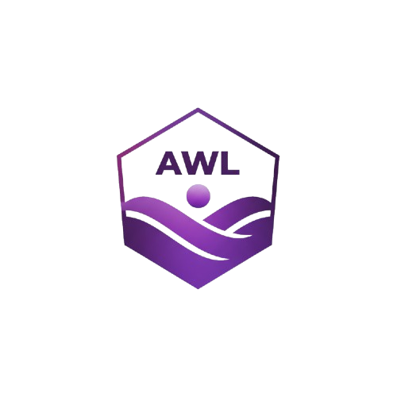

<p align="center">
  
</p>

<h1 align="center">AWL</h1>

<p align="center">
  <b>AWL</b> is a minimalist interpreted programming language written in TypeScript.<br/>
</p>

<p align="center">
  <a href="https://github.com/atoms19/AWL/stargazers">
    
  </a>
  <a href="https://github.com/atoms19/AWL/issues">
    
  </a>
  <a href="https://github.com/atoms19/AWL/blob/main/LICENSE">
    
  </a>
  <a href="https://github.com/atoms19/AWL">
    
  </a>
</p>
<p align="center">
  <a href="#Introduction">Introduction</a> •
  <a href="#getting-started">Getting Started</a> •
  <a href="#syntax-overview">Syntax Overview</a> • 
  <a href="#syntax-highlighting">Syntax Highlighting</a> •
  <a href="#future-plans">Future Plans</a>
</p>


# Introduction

AWL is my second semester personal project its an interpreted programming language written entirely in Typescript,
it features a hand rolled recursive descend parser , a lexer and a treeWalk AST interepreter 
as of now it supports basic programming constructs a mini standard library and basic data constructs like structs and arrays 
with plans to extend it further in the future

## Why AWL?
AWL was made for fun and as a learning experience,it rather allowed me to explore 
different ways of implementing common features 
awl is distinct in its syntax and semantics and it tries to be diffrent for the sake of it 
its not meant for production use or real world applications (at least as of now)

awl can be used for quick prototyping of algorithms and basic scripting and automation tasks 
other area where awl can be used is in educational purposes to teach programming concepts

# Getting Started 

## Using the binary executable
awl has a binary executable in the repo , its just named awl you can check the releases to get this executable 
download the file and run it in your terminal give it a file that contains awl code

```bash
./awl yourfile.awl
```

its that easy youll see the output , ( might not work on windows or mac {not tested})

## Using from source 
tho ugh its recommended to use the binary executable you can also run awl from source
- make sure you have nodejs or bun runtime installed

- clone the repo
```bash
git clone https://github.com/atoms19/AWL.git
cd AWL
```

- install dependencies 
```bash
npm install
# or
bun install
```
- run awl interpreter 
```bash
node main.ts yourfile.awl
# or
bun main.ts yourfile.awl
```

you can also build the project as a binary using bun or pkg 

## debug Mode 
you can run awl in debug mode using the `--debug` flag this will print the tokens generated by the lexer
the AST generated by the parser and the runtime errors with stack trace
```bash
./awl yourfile.awl --debug
```
flag should be given after the filename


# Syntax
### Hello world in AWL 

some of the awl syntax feels less in line with other languages and thats intentional to make it stand out in a wierd way and some of it me just being wacky ```awl printOut("Hello World")
printOut prints every line in a new line ,
to avoid this behaviour you can use 
printInline

```rust
printInline("Hello ")
printInline("World")
```

this will be printed in the same line as "hello world" printInline is more primitvie than printOut and can only print one value at a time


### Variables in AWL
variables are declared using the `let` keyword 

```js
let x = 10
let  name = "vish"
```
variables are dynamically typed , you can reassign them as well

you can convert between types using the following functions 

```js
toInt(x) // converts x to integer
toString(x) // converts x to string
toFloat(x) // converts x to float
toArray(x) // converts x to array
toChar(x) // converts x to character (x : charcter code)
toCharCode(x) // converts x to character code (x : character)
```

basic datatypes in awl are Numeric , String , Array

### Comments in AWL
comments in awl are done with `#` for single line comments and 
`### ###` for multi line comments 

```py
# this is a single line comment

###
this is a multi line comment
###
```

### Data types in AWL
- Numeric : represents both integers and floating point numbers
- String : represents a sequence of characters or a single character
- Array : represents a collection of values, can hold mixed datatypes including other arrays
- Boolean : represents true or false values
- Null : represents a null value

### Functions in AWL

#### builtin functions
these are some of the builtin functions in awl

- `printOut(x)` : prints x to the console
- `printInline(x)` : prints x to the console without a new line
- `getInput(x)` : takes input from the user and returns it as a string, x is the prompt message 
- `arrayLength(x)` : returns the length of x array
- `arrayInsert(x, value)` : inserts value to the end of array x
- `arrayInsertAt(index, value, x)` : inserts value at index of array x
- `arrayRemoveAt(index, x)` : removes the element at index from array x
string operations are expected to be done by converting them to array of characters
- `getTime()` : returns the current time in milliseconds since epoch


#### user defined functions
functions are declared using `fun` keyword 
once defined a function can be called using its `name()` just like in other languages 

```rust
fun add(a,b) {
    return a + b
}
let result = add(20, 10) 
printOut(result) // prints 30
```

functions support `return` statement to return a value from the function
statements after return are not executed

only positional paramerters are supported as of now

## Control flow in AWL
control flow in awl is done using `if` ,`while` and `for` keywords 
all control statements can be followed by a block of code enclosed in `{}`
or a single statement without `{}`

```rust
let x = 10
if (x > 5) {
    printOut("x is greater than 5")
}else if (x == 5) {
    printOut("x is equal to 5")
} 
else{
    printOut("x is less than 5")
}
```

```rust
let i = 0
while(i < 10) {
    printOut(i)
    i = i + 1
}
```


```
if(condition) printOut("single statement if")
```

`break` can be used to exit a loop , its behaviour for nested loops might be broken

### for loops 
due to furstration of writing while loops i finally took my time to write for loops
for loops in awl is super simple they support ranges 

#### ranges 
```rust
for (i in 0 -> 10 ){
    printOut(i)
}
```
the above loop will print numbers from 0 to 9

ranges can also be descending
```rust
for (i in 10 -> 0 ){
    printOut(i)
}
```
the above loop will print numbers from 10 to 1

    
ranges can also be return values of functions 

```rust
for( i in  0 -> arrayLength(arr)){
    printOut(arrayGet(i, arr))
}
```
##### specifiying step in ranges 

you can also specify step in ranges using `by` keyword after the end value of the range 

```rust
for( i in 0 -> 10 by 2){
    printOut(i)
} 
```

ranges can be negative as well 

```rust
for( i in 10 -> 0 by -2){

    printOut(i)
} 
```
floating point steps are supported as well 

```rust
for( i in 0 -> 1 by 0.1){
    printOut(i)
}
```


#### iterators 
you can also iterate over arrays using for loops 

```rust
let arr = [1,2,3,4,5]
for( item in arr) {
    printOut(item)
}
```

string iterations are easier now 

```rust
let str = "hello"
for( char in toArray(str)) {
    printOut(char)
}
```

`break` and `continue` statements are supported in for loops as well

### bite wise operations in AWL 
awl uses functions for bitewise operations unlike other c based languages 
we reserve most symbols for syntactic meaning rather than bitewise as you wont be 
dealing with bitewise often 

- `AND(a,b)` is bitewise and 
- `OR(a,b)` is bitewise or 
- `XOR(a,b)` is bitewise xor 
- `NOT(a)` is bitewise not 
- `L_SHIFT(a,b)` is left shift
- `R_SHIFT(a,b)` is right shift

### Arrays in AWL

arrays are declared using square brackets 

```rust
let arr = [1,2,3,4,5]
let strArr = ["hello", "world"]
```

arrays can hold mixed datatypes as well ,including other arrays 

```rust
let mixedArr = [1, "hello", 2.5, [1,2,3]]
```

arrays are dynamically sized , you can add or remove elements from them
you can access the elements from an array at any index using `<array-name>[index]` 

```py
let arr = [1,2,3,4,5]
printOut(arr[0]) #prints 1

```

you can also modify the elements at any index the same way by assigning to an index
```py
let arr = [1,2,3,4,5]
arr[0] = 10
printOut(arr[0]) #prints 10
```


arrays also support negative indexing just like in python 
```py
let arr = [1,2,3,4,5]
printOut(arr[-1]) #prints 5
```

#### array slicing 

arrays can be sliced using the same syntax we used in ranges 

```py
let arr = [1,2,3,4,5]
let slicedArr = arr[1 -> 4] #slicedArr = [2,3]

```
you can also specify step in slicing 
```py
let  arr = [1,2,3,4,5]
let slicedArr = arr[0 -> 5 by 2] #slicedArr = [1,3,5]
```


#### array operators 
`<~` operator is used to push to an array 

```py
let arr = [1,2,3]
arr <~ 4 # arr = [1,2,3,4]
```

you can also insert to a specific index using `<~`  operator 

```py
let arr = [1,2,3]
arr[1] <~ 1.5 # arr = [1,1.5,2,3]
```

for removing elements the suggested way is to use the builtin function `arrayRemoveAt(index, array)`

```py
let arr = [1,2,3,4,5]
arrayRemoveAt(2, arr) #arr = [1,2,4,5]
```

builtin functions for inserting still exist the operators are just syntactic sugar over them

for removing at any index using operators you can use `~>` operator 

```py
let arr = [1,2,3,4,5]
arr ~> 2 #arr = [1,2,4,5]
```
this will remove the element at index 2 from array but will not return it , as its a standalone statment 
and not to be confused with expressions or to be used in them 

the sugged way is to store the value to be removed in a variable first and then remove it 

```py
let arr = [1,2,3,4,5]
let valueToRemove = arr[2]
arr ~> 2
printOut(valueToRemove) #prints 3
```

or you could just use the builin function `arrayRemoveAt` which returns the removed value 

```py   
let arr = [1,2,3,4,5]
let removedValue = arrayRemoveAt(2, arr)
printOut(removedValue) #prints 3
```

enhancements in this area is expected in the next update 


### Strings in AWL
strings are declared using double quotes 

```rust
let str = "hello world"
```

strings can be concatenated using `+` operator 

```rust
let str1 = "hello"
let str2 = "world"
let str3 = str1 + " " + str2 #str3 = "hello world
```

strings can be accessed indexing just like arrays 

```rust
let str = "hello"
printOut(str[0]) #prints h
```

strings are immutable , you cannot modify a character at an index
you can convert a string to an array of characters using `toArray()` function


#### string slicing 
strings can be sliced using the same syntax we used in ranges 

```rust
let str = "hello world"
let slicedStr = str[0 -> 5] #slicedStr = "hello"
```
you can also specify step in slicing
```rust
let str = "hello world"
let slicedStr = str[0 -> 11 by 2] #slicedStr = "hlowrd"
```
negative steps are supported for both array slicing as well as string slicing but awl does not have negative indexing 

-----

# Standard Library: stdlib/string

The string module provides essential helper functions for string manipulation and inspection.

You must first include the module to use its functions:

```rust
include "stdlib/string.awl"
```

-----

## Functions

### fun stringLen(str)

Returns the total number of characters in a string.

```js
let name = "AWL"
let len = stringLen(name)
printOut(len) # Prints 3

let empty = ""
printOut(stringLen(empty)) # Prints 0
```

-----

### fun stringRepeat(str, count)

Returns a new string by concatenating the original `str` to itself `count` times.

```js
let s = "xo"
let repeated = stringRepeat(s, 3)
printOut(repeated) # Prints "xoxoxo"

printOut(stringRepeat("=", 10)) # Prints "=========="
```

-----

### fun stringLTrim(str)

Removes all whitespace characters from the **L**eft (beginning) of a string.

```py
let s = "   hello world"
let trimmed = stringLTrim(s)
printOut(trimmed) # Prints "hello world"
```

-----

### fun stringRTrim(str)

Removes all whitespace characters from the **R**ight (end) of a string.

```py
let s = "hello world   "
let trimmed = stringRTrim(s)
printOut(trimmed) # Prints "hello world"
```

-----

### fun stringTrim(str)

Removes all whitespace characters from both the beginning **and** the end of a string. This is a combination of `stringLTrim` and `stringRTrim`.

```py
let s = "   hello world   "
let trimmed = stringTrim(s)
printOut(trimmed) # Prints "hello world"
```

-----

### fun stringToUpper(str)

Returns a new string with all alphabetic characters converted to their uppercase equivalent.

```py
let s = "Hello World 123!"
let upper = stringToUpper(s)
printOut(upper) # Prints "HELLO WORLD 123!"
```

-----

### fun stringToLower(str)

Returns a new string with all alphabetic characters converted to their lowercase equivalent.

```py
let s = "Hello World 123!"
let lower = stringToLower(s)
printOut(lower) # Prints "hello world 123!"
```

---
---

### Operators in AWL

#### Arithmetic operators
- `+` : addition
- `-` : subtraction
- `*` : multiplication
- `/` : division
- `%` : modulus
- `^` : exponentiation

#### Comparison operators
- `==` : equal to
- `!=` : not equal to
- `>` : greater than
- `<` : less than
- `>=` : greater than or equal to
- `<=` : less than or equal to

#### Logical operators
- `&&` : logical and
- `||` : logical or
- `!` : logical not

### Structs in AWL 
structs are datastructures that can hold multiple values of different types 
they are declared using the `struct` keyword 

```rust
struct Person {
     let name = ""
     let age = 0
     let isStudent =false 
}
```

you can create an instance of a struct using the `new` keyword 

```js
let person1 = new Person
person1["name"] = "vish"
person1["age"] = 20
person1["isStudent"] = true

printOut(person1["name"]) #prints vish
```

as of now struct definitions are not local scopped they are global only
a more easier way to access struct properties is planned in the future
as well as support for methods in structs

### File operations in AWL
awl supports basic file operations using builtin functions
- `fileWrite(filename, content)` : writes content to a file with name filename
- `fileRead(filename)` : reads content from a file with name filename and returns it as a string
- `fileAppend(filename, content)` : appends content to a file with name filename
- `fileExists(filename)` : checks if a file with name filename exists and returns true or false

### running shell commands
you can run shell commands using the `runCommand(command)` function
it takes a string command as an argument and returns the output of the command as a string
```rust
let output = runCommand("ls -la")
printOut(output)
```


### Including other awl files
you can include other awl files using the `include` keyword 
this is very similar to `#include` in C/C++ 

```rust
include "otherfile.awl"
```

this is how we can have awl files with reusable code and import them in other files
pretty much everything from the other file is imported into the current file 
so make sure that there are no name conflicts

- will be working on a proper module system once classLoader is implemented 

```rust 
# math.awl
fun add(a,b) {
    return a + b
}
```


```rust 
include "math.awl"

let result = add(10, 20) # assuming add is defined in math.awl

printOut(result) #prints 30
```


there is no standard library as of now so you have to write your own utility functions
might add a standard library in the future

## extra libarires 


-----

# Standard Library: stdlib/math

The math module provides common mathematical constants and functions. Some functions (`sin`, `cos`, `ln`) are assumed to be fast, native functions provided by the interpreter, while others are derived from them and written in pure AWL.

You must first include the module to use its functions:

```awl
include "stdlib/math.awl"
```


-----

## Constants

### let PI

The constant $\pi$ (Pi), approximately $3.14159...$. Used for circle and trigonometric calculations.

### let e

The constant $e$, approximately $2.71828...$. The base of the natural logarithm.

-----

## Utility Functions

### fun min(a, b)

Returns the smaller of the two numbers `a` and `b`.

```awl
printOut(min(10, 20)) # Prints 10
```

### fun max(a, b)

Returns the larger of the two numbers `a` and `b`.

```awl
printOut(max(10, 20)) # Prints 20
```

### fun abs(a)

Returns the absolute (non-negative) value of `a`.

```awl
printOut(abs(-5.5)) # Prints 5.5
printOut(abs(5.5))  # Prints 5.5
```

-----

## Rounding Functions

### fun ceil(a)

Returns the "ceiling" of `a`, which is the smallest integer greater than or equal to `a`. It rounds numbers **up**.

```awl
printOut(ciel(3.1)) # Prints 4
printOut(ciel(3.0)) # Prints 3
printOut(ciel(-3.9)) # Prints -3
```

### fun floor(a)

⚠️ **Important Note:** This function truncates the decimal (rounds toward zero). This matches `floor` for positive numbers, but not for negative ones.
(e.g., The true mathematical `floor` of $-3.9$ is $-4$, but this function will return $-3$).

```awl
printOut(floor(3.9)) # Prints 3
printOut(floor(-3.9)) # Prints -3 (truncated)
```

### fun round(a)


Returns the value of `a` rounded to the nearest integer. Numbers ending in `.5` are rounded away from zero.

```awl
printOut(round(3.1)) # Prints 3
printOut(round(3.9)) # Prints 4
printOut(round(-3.9)) # Prints -4
```

-----

## Power & Log Functions

### fun sqrt(a)

Returns the square root of `a` by calculating $a^{0.5}$.

```awl
printOut(sqrt(100)) # Prints 10
```

### fun log(a)

Returns the **base-10 logarithm** of `a`. This function assumes a native function `ln(a)` (natural log) exists.

```awl
printOut(log(100)) # Prints 2
```

-----

## Trigonometric Functions

`sin(a)` and `cos(a)` are provided as native functions and that `a` is in radians.

### fun tan(a)

Returns the tangent of `a`.

### fun sec(a)

Returns the secant of `a`.

### fun cosec(a)

Returns the cosecant of `a`.

### fun cot(a)

Returns the cotangent of `a`.
-----


---
# Standard Library: stdlib/complex

The complex module provides functions and a data structure for performing complex number arithmetic. This is essential for advanced mathematical, scientific, or engineering calculations.

You must first include the module to use its functions:

```awl
include "stdlib/complex.awl"
```

-----

## Data Structure

### struct ComplexNo

This is the core data structure used by the module to store a complex number. It contains two fields:

  * `real`: The real part of the number.
  * `img`: The imaginary part of the number.

You should not typically create this struct directly. Use the `complex()` constructor function instead.

-----

## Functions

### fun complex(real, imaginary)

This is the "constructor" function. It creates and returns a new `ComplexNo` struct populated with the given real and imaginary components.

```js
let c1 = complex(3, 4)
```
This creates a complex number representing $3 + 4i$.

### fun complexAdd(c1, c2)

Returns a new `ComplexNo` struct that is the **sum** of `c1` and `c2`.

```js
let a = complex(1, 2)
let b = complex(3, 4)
let sum = complexAdd(a, b)
```
 'sum' is now a ComplexNo struct { real: 4, img: 6 }

### fun complexSub(c1, c2)
Returns a new `ComplexNo` struct that is the **difference** of `c1` and `c2` ($c1 - c2$).

```py
let a = complex(5, 5)
let b = complex(1, 2)
let diff = complexSub(a, b)
# 'diff' is now a ComplexNo struct { real: 4, img: 3 }
```

### fun complexMul(c1, c2)

Returns a new `ComplexNo` struct that is the **product** of `c1` and `c2`.

```py
let a = complex(2, 3)
let b = complex(4, 5)
let product = complexMul(a, b)
# 'product' is now a ComplexNo struct { real: -7, img: 22 }
```

### fun complexDiv(c1, c2)

Returns a new `ComplexNo` struct that is the **quotient** of `c1` and `c2` ($c1 / c2$). It will print an error and return `0 + 0i` if a division by zero is attempted.

```py
let a = complex(-7, 22)
let b = complex(2, 3)
let quotient = complexDiv(a, b)
# 'quotient' is now a ComplexNo struct { real: 4, img: 5 }
```

### fun complexMagSqr(c)

Returns a **Numeric** (not a complex number) representing the **magnitude squared** ($|c|^2$) of the complex number $c$. This is faster than `complexMag` as it avoids a square root operation.

**This is the preferred function for escape-time fractals (like Mandelbrot).**

```py
let c = complex(3, 4)
let magSqr = complexMagSqr(c)
printOut(magSqr) # Prints 25
```

### fun complexMag(c)

Returns a **Numeric** representing the **magnitude** ($|c|$) of the complex number $c$. This is the actual length or "distance from zero" of the number.

```py
let c = complex(3, 4)
let mag = complexMag(c)
printOut(mag) # Prints 5
```

### fun complexConj(c)

Returns a new `ComplexNo` struct that is the **conjugate** of $c$. The conjugate of ($a + bi$) is ($a - bi$).

```py
let c = complex(3, 4)
let conj = complexConj(c)
# 'conj' is now a ComplexNo struct { real: 3, img: -4 }
```

### fun complexNeg(c)

Returns a new `ComplexNo` struct that is the **negation** of $c$. The negation of ($a + bi$) is ($-a - bi$).

```py
let c = complex(3, 4)
let neg = complexNeg(c)
# 'neg' is now a ComplexNo struct { real: -3, img: -4 }
```


## Syntax highlighting 

if you want syntax highlighting for awl in the best editor in the world 
you can use the file named `awl.vim` in the repo put it in your `~/.nvim/syntax/` folder
or `$VIMRUNTIME/syntax/` folder

and then run the following command to enable it 

```vim
:set syntax = awl
```


## Future Plans

- add closures 
- add a standard library (math , string )
- more optimizations 

awl is supposed to be a typesafe language but as of now it isnt
i plan to add typesafety in the future 
along with a simple standard libary and support for obejct oriented paradigm


